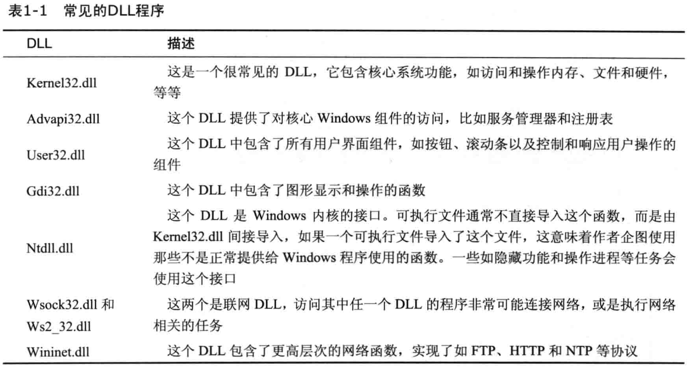

## 第一章.静态分析基础技术

### 1. 哪些技术可以从可执行文件中提取出有用的信息？

#### （1）反病毒软件确认程序样本的恶意性

#### （2）使用哈希识别恶意代码

    哈希为恶意代码的指纹
    `md5deep sol.exe`可计算sol.exe的哈希值

#### （3）Strings程序搜索可执行程序中可打印的字符串

    一些可打印的字符串：打印出的消息，连接的URL，复制文件到某个特定位置
        识别出URL：这个字符串很可能是恶意代码将其以某种方式使用进行上网
    一些短的字符串且不是一个单词，可能没有意义

    Notes:
        在fuzzing过程中，有时需要Strings去检查binary中是否插入了asan，或是否正常插入了AFL的桩，因为有时通过cflags去指定asan无效，可能有独特的指定编译选项的方法,所以binary中会显示没有插入asan，所以感觉程序没有按照预期的那样崩溃

### 2. 加壳与混淆恶意代码

#### （1）加壳后的恶意代码会被压缩，对其直接分析获取到的可打印字符串很少

    使用Strings程序搜索一个程序，如果发现它的字符串很少，则其极有可能是混淆或加壳的
    加壳和混淆代码通常至少包含`LoadLibrary`和`GetProcAddress`函数，它们是用来加载和使用其他函数功能的

#### （2）使用PEiD检测加壳

    检测加壳器的类型，或用来链接应用程序的编译器类型
    使用UPX加壳工具非常流行，也非常容易进行脱壳处理`upx -d a.exe`

#### （3）PE文件格式

    PE文件以一个文件头开始，包括代码信息，应用程序类型，所需的库函数与空间要求

#### （4）链接库与函数

    对于一个可执行程序，可以收集到的最有用的信息之一是它的导入表，在PE文件头中课找到链接的库函数
    Dependency Walker探索动态链接函数

